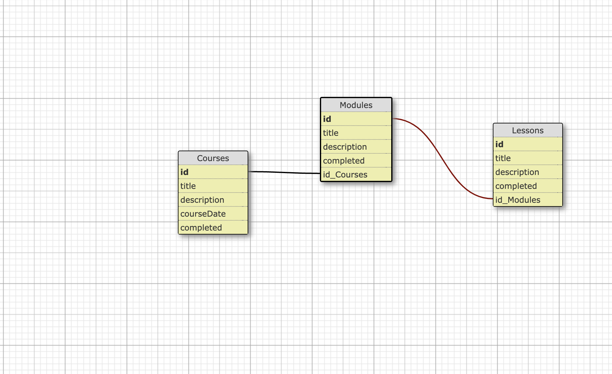

# Challenge 0 - Overview

This series of challenges is meant to walk you through the steps needed to
set up `XRServer` and `PlayFab`, as well as guide you on how to integrate these
platforms into the sample web app built in `SvelteKit`.

The main goal of these challenges is to demonstrate how we can leverage XRServer
and PlayFab as a platform to enable us to run LiveOps campaigns to drive further
User engagement within our applications.

## Scenario

The scenario of this Challenge series is that we have an existing Education
platform `named **EduMate** that allows our students to complete their lessons online.

Currently, our users can use the **EduMate** to track their course progress for a `Math` course, and also an `English` course.

Now, this is where [`PlayFab`](https://playfab.com/) and [`XRServer`](https://www.xrserver.com/) come in! How about we take this a step further and integrate [LiveOps](https://playfab.com/liveops/) capabilities that will allow our EduMate platform to incentivise our students to finish their courses!

One great way we can drive daily user interaction is to *reward our users with a badge for finishing the course*.

Let us then walk through the challenges, and learn about how we can use `XRServer` and `PlayFab` to set up a backend platform to make badge rewarding easy!

The integration into XRServer and our EduMate platform would have to be done by a developer (most likely the one following this tutorial), however once this is set up we could hand the backend to a non-technical colleague to easily drive different LiveOps campaigns to incentivize our students!

## Learning Objectives

- Increased familiarity of `PlayFab` and `XRServer`
- Understanding of how to integrate LiveOps using `PlayFab` and `XRServer`

## Data Schema

For our students to complete a Course, they will need to first do their `Lessons` that are found within a Course's `modules`. To get a better idea of how this data structure is laid out

Here is an example of the Data Schema:

## Getting Started

Now, the first step will be is to follow the `Developing` section
of the [`/app/README.md`](../app/README.md#developing). This will be where you will learn about which dependencies are used for the sample application and which technologies you will need to complete the challenges.

Once you've verified that you can run the base application in the [`app folder`](../app/README.md#edumate-sample-app) and use `Supabase` (see link to `app folder`)

[**Proceed to `Challenge01`**](Challenge01.md)

> As a note, some of the pages may not function as expected. For example, you will not be able to navigate to `Login` or `Register` given that a Sample user is hardcoded in the `hooks.server.ts` file, and this should be fixed by you when the challenge for integrating wtih PlayFab authentication is attempted.

## Resources

- [PlayFab](https://playfab.com/)

- [Alice & Smith's XR Server](https://www.xrserver.com/)

- [Alice & Smith's Website](https://www.aliceandsmith.com/)

- [LiveOps](https://playfab.com/liveops/)

- [SvelteKit Tutorial](https://kit.svelte.dev/docs/introduction)
