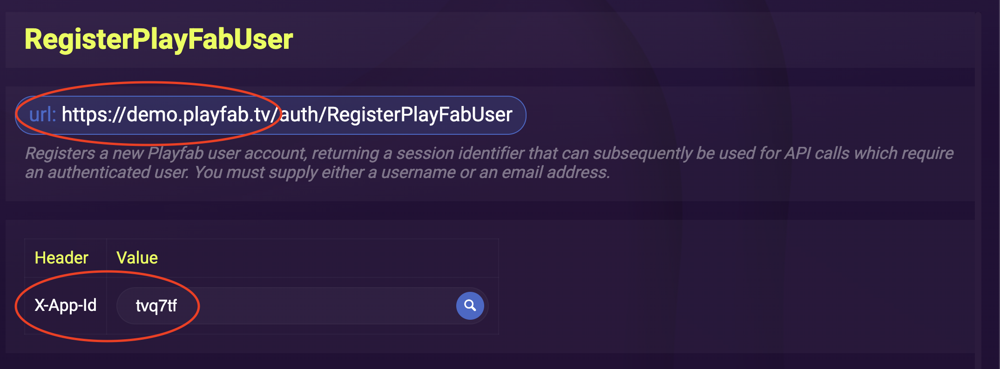

# Challenge 1 - PlayFab and XRServer setup

At the end of this challenge, challengers should know how to initialize an XRServer App and a corresponding Playfab Title.

## PlayFab

Follow [this quickstart guide](https://learn.microsoft.com/en-us/gaming/playfab/gamemanager/quickstart) to create your PlayFab Account, Studio, and Title.  

Once your Title has been created, go to the `Title Settings`


On the `Api Features` tab, take note of the 5 character `Title Id`.


On the `Secret Keys` tab, take note of the 50 character `Secret Key`. This will be used by XRServer to authenticate API calls to your PlayFab Title. **Do not distribute the secret key elsewhere!**


## XRServer

Follow the [Step 1: Cloud Server Installation video](https://www.xrserver.com/demo) if setting up the XRServer for the first time.

If using an existing XRServer, create a new App that will correspond to your PlayFab Title

Go to the App's `Config` page. The first tile listed is the `App Config` tile. Select the tile and take note of the App's 6 character `AppId`.


On the `Config` page, scroll down to the `Services Config` section. Turn on and configure the `PlayFab` tile using the Title Id and Secret Key from your PlayFab Title.


## Code Config

In your XRServer App, go to the `Developer Console`.


The `Developer Console` can be used to test the endpoints of your App. Select any endpoint and take note of the `url` and the `X-App-Id` header.



Save these values to your config file for your front end web app.


## WebApp

The demo application that is guided along with this uses [Svelte](https://svelte.dev/) and [SvelteKit](https://kit.svelte.dev/).

To run the application, you will need to set up a `.env` file and set the following variables:

- The PlayFab App ID
- The XR Server Base URL

Each .env added for Svelte Environment has to be prefaced with `VITE`
```.env
<!-- /app/.env -->
VITE_BASE="https://demo.playfab.tv"
VITE_APP_ID="v0u9yv"
```
