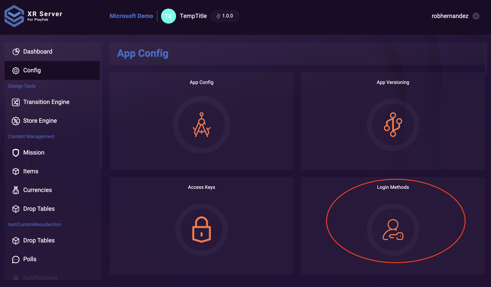
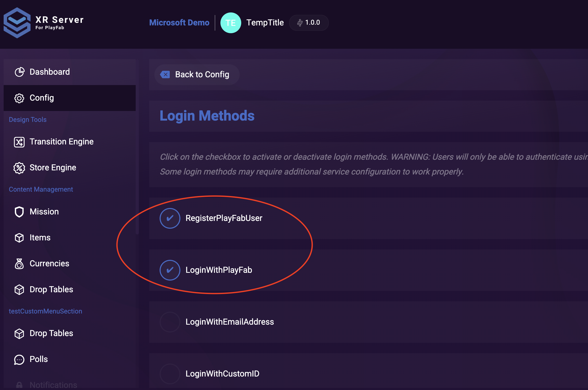
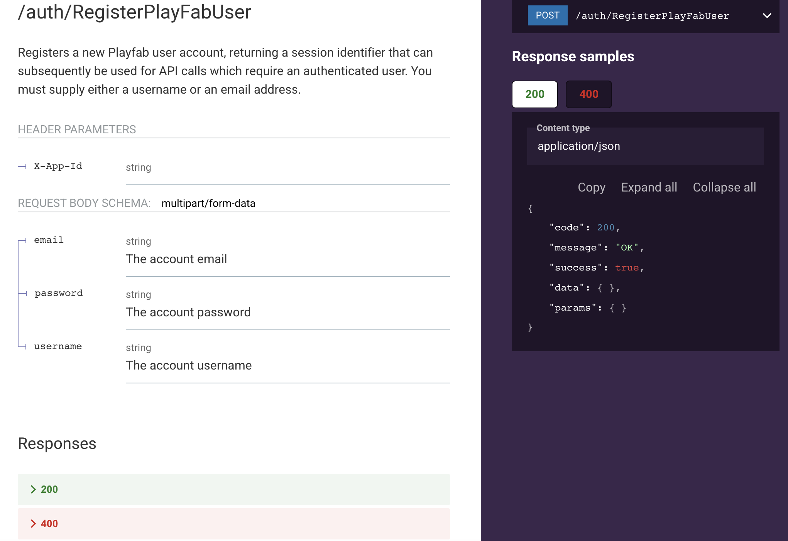
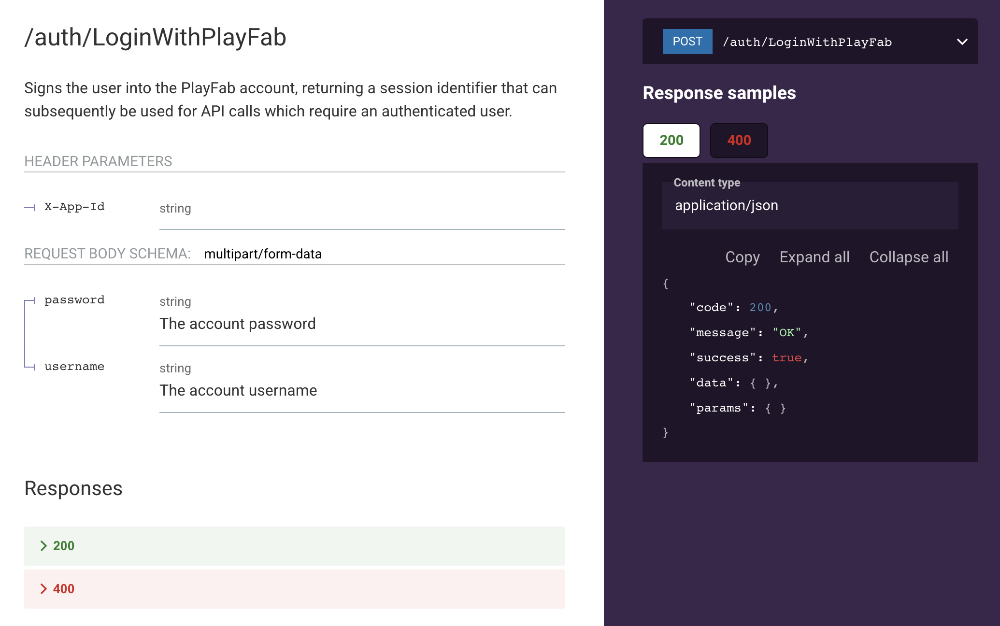

# Challenge 2 - Registering a User and Logging in

At the end of this challenge, challengers should know how to enable User Registration and Login using the API and will have enabled the User Registration and Login API using the front end app.

## XRServer

Ensure you have completed Challenge 1

Begin by logging into your XRServer instance and selecting your previously created Title.

Go to the App's `Config` page. The fourth tile listed is the `Login Methods` tile.



Select "RegisterPlayFabUser" and "LoginWithPlayFab" from the list of login methods.



This enables the /auth/RegisterPlayFabUser and the /auth/LoginWithPlayFab APIs on your instance.





[Official Documentation](https://doc.xrserver.com/auth/#tag/Basic-Authentication/paths/~1auth~1RegisterPlayFabUser/post)

## Test the App

Test your Registration API with the Developer Console by registering a User on /auth/RegisterPlayFabUser

Example Request Body:

```json
{
    "email" : "user.email@outlook.com",
    "password" : "REPLACE_ME",
    "username" : "user.name"
}
```

You should receive a 200 OK application/json response that looks like:

```json
{
    "code": 200,
    "message": "OK",
    "success": true,
    "data": {},
    "params": {}
}
```

Then test your Login API with the Developer Console by registering a User on /auth/LoginWithPlayFab

```json
{
    "password" : "REPLACE_ME",
    "username" : "user.name"
}
```

You should receive a 200 OK application/json response that looks like:

```json
{
    "code": 200,
    "message": "OK",
    "success": true,
    "data": {},
    "params": {}
}
```

## Implement Registration and Login in a Web App

Add a login/signup form to your web app. Use the APIs you enabled in the previous step.  Also, implement the required `login and register functions` found in [`playfabService.ts`](../app/src/lib/services/playfabService.ts).

Verify your solution works end to end, i.e. you can register a user, login with the newly created user and capture the value of the `SessionTicket` returned from the API.

Exactly how you implement this is up to you, although you can use the following code as a starting point:

`https://svelte.dev/repl/ca967b45a5aa47b2bb2f9118eb79eefe?version=3.50.1`

> NOTE: in `hooks.server.ts` , this is where you'll want to pass the PlayFabID to each request for the user.
> currently, it is hard-coded to a SAMPLE user
>
>```typescript
> event.locals.user = { playfabId: "SAMPLE" };
> ```
>
> You will need to remove this when you want to verify that your user is successfully logged in.

## Summary

Congratulations! You have successfully enabled User Registration and Login, and created a User on your XRServer instance!

At this point you should be able to Register a New User, and login through the app.

## Resources

- [PlayFab Developer Portal](https://developer.playfab.com/en-us/my-games)

- `XRServer Developer Portal` -  <https://xxx.playfab.tv/editor/> (Need to replace xxx with own domain)

- `XRServer Developer API Console` <https://xxx.playfab.tv/editor/console/Auth> (Need to replace xxx with own domain)

- [SvelteKit Sample Code](https://svelte.dev/repl/ca967b45a5aa47b2bb2f9118eb79eefe?version=3.50.1)
