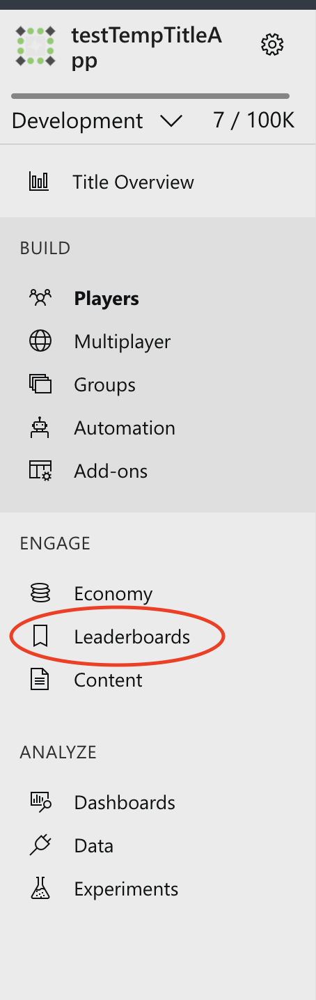
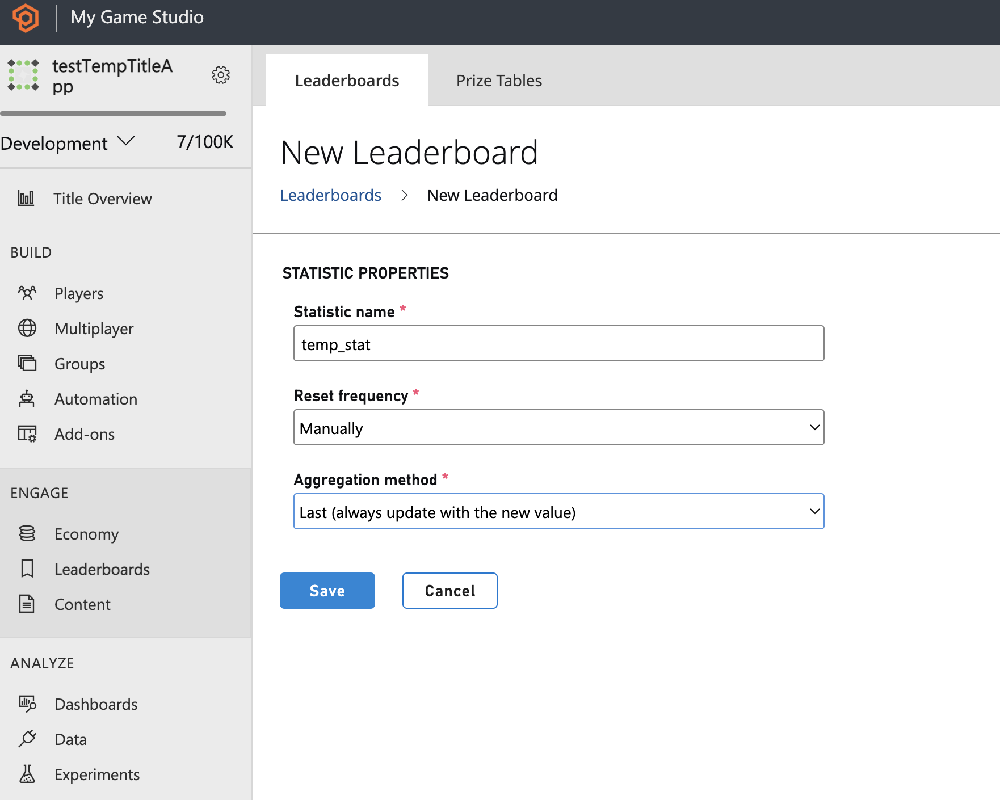
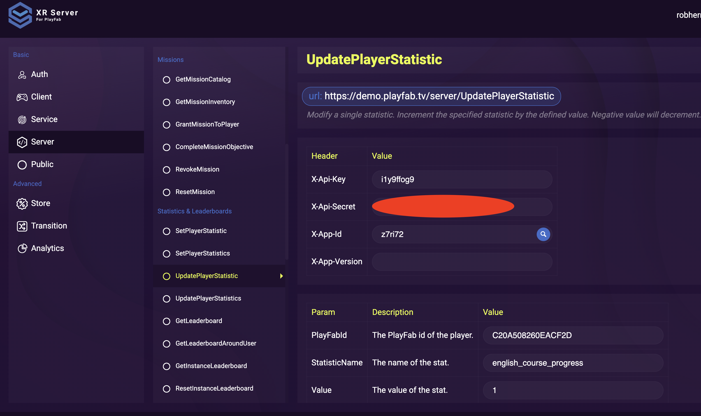
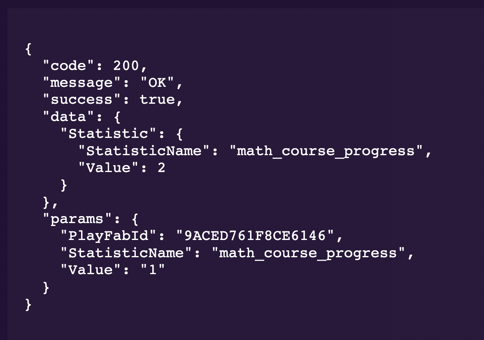

# Challenge 3 - Segment Users based on criteria

At the end of this challenge, challengers should know how to create segments and be able to add users to a segment using a custom statistic

In this challenge we will segment users based on some criteria using XRServer
By End of Challenge 4, the challenger should have created these following Segments:

 - Math Course
    - Segment created for Starting Math Course
    - Segment created for finishing Math Course

* English Course
    - Segment created for starting English
    - Segment created for finishing English

## XRServer

Ensure you have completed Challenge 2

Begin by logging into your XRServer instance and selecting your previously created Title.

 Get the PlayFabId for the User you want to edit from the Login API call

 # Create a Segment
In the Developer Console, on the left hand side select Segments

Select Create Segment 

You will receive a prompt to name your new segment

Create a few segments that you want your users to move through during the course of using your app 

Select "Leaderboards" from the left hand side of the Playfab Menu 

Create a new App Statistics using PlayFab "New Leaderboard" which will allow a statistic to be available to all users 

Don't forget to save!

In the Segment view of XRServer, select your segment and use the Segment Design diagram to Filter on a Statistic 

Again, don't forget to save!

# Set or update a statistic on a user, moving them into a segment 

In the Developer console, using the PlayFabId obtained during the Login API call, under the Server section, find UpdatePlayerStatistic endpoint and use it to increment your users statistic value by 1

You should now see a user added to your segment, if you do not, double check that you saved your segment design in the editor (if you haven't saved there will be a Orange Exclamation mark on the right hand side of the Segment Design view) 

If we increment the segement again, we can see the user moves into the next one (in this example that filter was already created)

You should also now be able to view the count of users that are in any given segment 

# Summary
Congratulations, you have now created a segment and added a user to it using a custom statistic!
