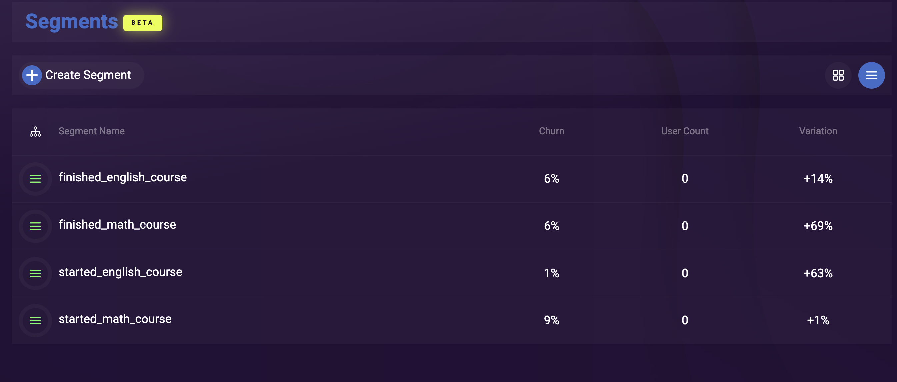

# Challenge 3 - Segment Users based on criteria

At the end of this challenge, challengers should know how to create segments and be able to add users to a segment using a custom statistic

In this challenge we will segment users based on some criteria using XRServer
By End of Challenge 4, the challenger should have created these following Segments:

 - Math Course
    - Segment created for Starting Math Course
    - Segment created for finishing Math Course

* English Course
    - Segment created for starting English
    - Segment created for finishing English


## XRServer

Ensure you have completed Challenge 2

Begin by logging into your XRServer instance and selecting your previously created App.

### Get the ID
 Get the PlayFabId for the User you want to edit from the Login API call, alternatively you can also use the PlayerId from the Users page in XRServer

 # Create a Segment

In XRServer, `Segments` should be one of the default pages available in the left side menu. If it's not, go to `Config` -> the `App Config` seciton -> the `Menu Layout` Tile. Here you can edit everything visible in your App's Menu. You can even rename `Segments` to something more appropriate to your business terminology.

In the XRServer Dashboard, on the left hand side select Segments


Select Create Segment 

You will receive a prompt to name your new segment


Create a few segments that you want your users to move through during the course of using your app 


In the Developer Console -> Server use the SetPlayerStatisticDefinition API to create a new statistic, this will generate a new Leaderboard for your 
App, which will allow that same statisctic to be tracked for individual users.


In the Segment view of XRServer, select your segment and use the Segment Design diagram to Filter on a Statistic 

Don't forget to save!

# Set or update a statistic on a user, moving them into a segment 

Creating a `statistic` is a great way to track user progress using the notion of "points" and will automatically generate a `leaderboard` for each `statistic` you create.

In the Developer console, using the PlayFabId obtained during the Login API call, under the Server section, find UpdatePlayerStatistic endpoint and use it to increment your users statistic value by 1


UpdatePlayerStatistic example response.  Note the statistic value has been incremented by 1, from the original value of 1 shown in the param, this was our preset filter for the `finished_math_course` segment
```json
{ 
    "code": 200,
    "message": "OK",
    "success": true,
    "data": {
        "StatisticName": "math_course_progress",
        "Value": 2,
    },
    "params": {
        "PlayFabId": "9ACED761F8CE6146",
        "StatisticName" : "math_course_progress",
        "Value" : 1
    }
}
```

You should now see a user added to your segment, if you do not, double check that you saved your segment design in the editor (if you haven't saved there will be a Orange Exclamation mark on the right hand side of the Segment Design view) 


If we increment the segement again, we can see the user moves into the next one (in this example that filter was already created)

You should also now be able to view the count of users that are in any given segment 

At this point, now that you've used the XRServer developer console to move users through segments, implement the same functionality in your app for your users to move through completion of your math or english courses.

# Summary
Congratulations, you have now created a segment and added a user to it using a custom statistic!
